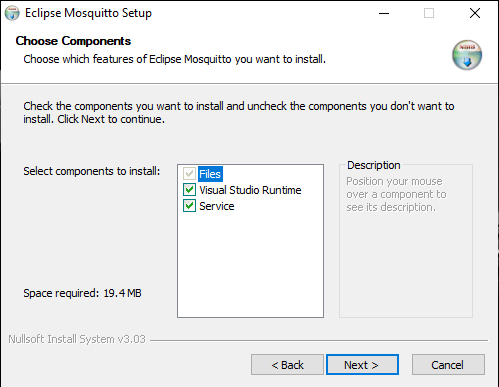

## Installation
### ESP32 in ArduinoIDE
1. Follow the install guide from https://docs.espressif.com/projects/arduino-esp32/en/latest/installing.html
### Mosquitto MQTT Broker
1. Download Mosquitto MQTT for your operating system from https://mosquitto.org/download/
2. Install Mosquitto MQTT and make sure that Mosquitto runs as a service (Windows install: check box service)
	
3. Got to the mosquitto install directory (Standart: "C:\Program Files\mosquitto").
4. Open mosquitto.conf with text editor of your choice (e.g. Notepad++).
5. Add the following two lines to the start of the conf-file.
```
	allow_anonymous true
	listener 1883
```
6. For Windows: check if mosquitto.exe is added to allowed programs in your firewall. If not add moquitto.exe
### Python
1. Install Python (This Project uses Python 3.17)
2. Via  `pip` :
	1. Install `plotly dash`
	2. Install `pandas`
	3. Install `paho-mqtt`
## Running the App
1. Set up wifi and MQTT in HSB_EMG.ino
	1. Input your WiFi information in
	``` 
	/* WIFI connection info */
	const char* ssid = "REPLACE WITH YOUR WLAN SSID";
	const char* password = "REPLACE WITH YOUR WLAN PASSWORD";
	```
	2. Enter MQTT IPv4 address in
	``` 
	/* IPv4 address of MQTT Broker */
	const char* mqtt_server = "REPLACE WITH YOUR MQTT BROKER IPv4 ADDRESS";
	```
2. Change sample rate and anlogue out to your needs
	1. `#define SAMPLE_FREQUENCY 500` defines the sample rate. The number is the time in microseconds between each measurement.
	2. The interrupt `void ARDUINO_ISR_ATTR onTimer()` reads the ADC and saves the data. To change the used analogue channel replace `analogRead(ADCout.a2);` with `analogRead(ADCout.a0);` to `analogRead(ADCout.a5);`. `a0` to `a5` correspond to the analogue inputs of the **MYOWARE Arduino Shield** when used with a **AZ-Delivery ESP32 NodeMCU D1 R32**.
3. Compile and upload the Arduino sketch to your ESP32 board.
4. Open a terminal and go to the HSB_EMG folder. Run `HSB_EMG_SUB.py` to start the web app.
5. To see the webapp open http://127.0.0.1:8050/
6. The top button starts communication with the ESP32 and the bottom one starts the data acquisition. **Always start communication first and acquisition second**. Make sure that data acquisition is stopped before your turn of communication.
7. The data is saved as a `.csv` in the folder auf the Python script.
8. To end the webapp press `ctrl+c` in the terminal.
	

